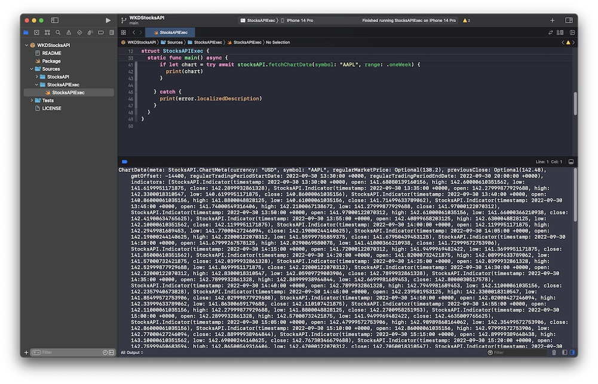

# WKDStocksAPI


A Swift Package / Library for asynchronous API access to finance.yahoo.com REST API endpoints. H/T to Alfian.

## Features
-- Fetching chart data for an array of timeframes
-- Search for stock ticker symbols by company name
-- Fetch quotes via ticker symbol
-- Uses Swift concurrency (async/await)
-- Fetches raw JSON data
-- Available on iOS(13+), macOS(12+), macCatalyst(13+), tvOS(13+) and watchOS(8+)
-- Use SwiftUI or UIKit

### Available via Swift Package Manager (SPM)

- File > Swift Packages > Add Package Depenency
- Add repo url (https://github.com/waynedahlberg/WKDStocksAPI.git)
- Use "Main" branch

## Example

### Initialize repository

Import and init the `WKDStocksAPI`.

```swift
import WKDStocksAPI

let api = WKDStocksAPI()
```

### Fetch AAPL stocks for the most recent trading day
```swift
let appleChart1d = try await api.fetchChartData(tickerSymbol: "AAPL", range: .oneDay)
```

### Search for ticker symbols using company name
```swift
let tickers = try await api.searchTicker(query: "Tesla")
```

### Fetch quote details for multiple stock symbols
```swift
let quotes = api.fetchQuotes(symbols: "AAPL, TSLA, GOOG, MSFT")
```


